# 💊 MyPills (МайПилс)

## Идея проекта

Разрабатываемый проект представляет собой систему персонализированного управления домашней
аптечкой, автоматизирующую логистический учёт препаратов и обеспечивающую их 
интеллектуальный подбор. Система позволяет контролировать сроки годности, мониторить 
остатки лекарств и упрощённо пополнять запасы. Алгоритм подбора по симптомам автоматически
проверяет препарат на совместимость с профилем пользователя (аллергии, противопоказания, 
статус) и рассчитывает персональные дозировки.

## Описание предметной области

Логистический блок через сущность Аптечка фиксирует остатки и сроки годности конкретных 
упаковок Лекарства, принадлежащих Пользователю, а интеллектуальный блок детализирует 
препараты через Клиническую информацию, Инструкцию, действующее Вещество и связанные 
Заболевания.

## Анализ аналогичных решений

| Критерий / Приложение                      | 💊 MyPills | Аптечка. Учёт медикаментов |  Medkit: Medication Tracker  |
|:-------------------------------------------|:----------------------------:|:--------------------------:|:--:|
| Учет остатков                              |              ✅               |             ✅              |  ✅  |
| Подбор по симптому                         |              ✅               |             ❌              | ❌ |
| Проверка аллергий, хронических заболеваний |              ✅               |             ❌              | ❌  |

## Обоснование целесообразности и актуальности проекта

Автоматизация домашней аптечки это необходимость, обусловленная стремлением к безопасности и экономии времени, 
позволяющая избежать хаоса в лекарствах, контролировать дозировки и сроки годности, подобрать нужное лекарство по
симптомам.

## Описание ролей

### Пользователь

Управляет содержимым своей аптечки и использует подбор лекарств на основе своего профиля здоровья и имеющихся запасов.

### Администратор

Следит за корректностью наполнения системы данными: добавление новых лекарственных средств, действующих веществ, актуализацию 
медицинских инструкций и правил дозирования.

### Неавторизованный пользователь

Может войти или зарегистрироваться, указав детальную информацию о себе для грамотного подбора лекарства. 

## Use-case - диаграмма
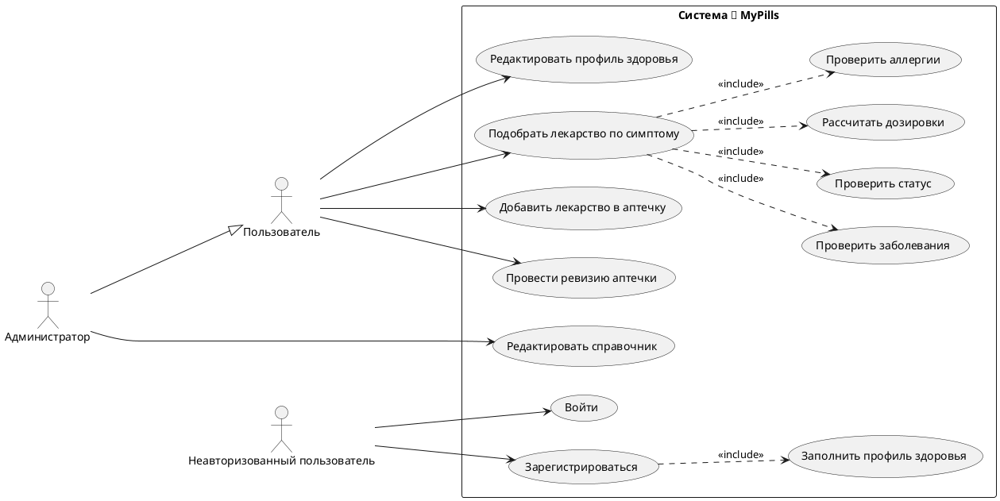

## ER-диаграмма
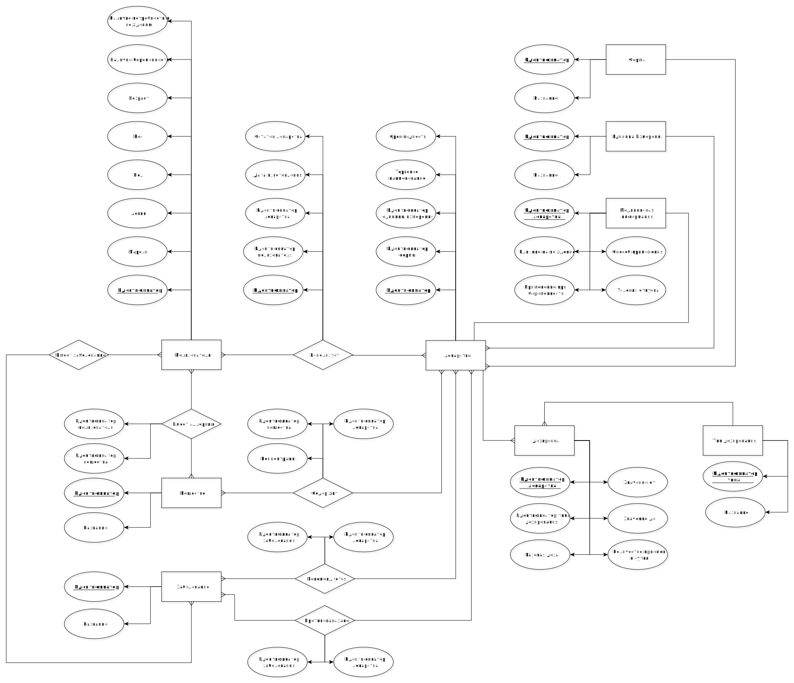

## Пользовательские сценарии

### Сценарий 1: Добавление нового лекарства в аптечку
**Актор:** Пользователь.
**Цель:** Зафиксировать наличие препарата и поставить его на контроль срока годности.

1.  Пользователь нажимает кнопку «Добавить» и вводит регистрационный номер (РН) с упаковки.
2.  Система выполняет запрос к таблице Лекарство по этому номеру.
3.  Если под одним РН зарегистрировано несколько дозировок, пользователь выбирает нужную.
4.  Пользователь указывает дату изготовления и текущее количество препарата в пачке.
5.  Система создает запись в таблице Аптечка, связывая её с профилем Пользователя и выбранным Лекарством.
6.  Препарат отображается в списке «В наличии», статус срока годности становится активным.

---

### Сценарий 2: Подбор препарата при возникновении симптома
**Актор:** Пользователь.
**Цель:** Получить безопасную рекомендацию по приему лекарства из имеющихся запасов.

1. Пользователь выбирает актуальный симптом.
2.  Система находит все лекарства, для которых данное заболевание указано в связи «Рекомендуется».
3. Проверка безопасности:
    * Система исключает препараты, содержащие вещества, на которые у пользователя есть аллергия.
    * Система исключает препараты, которые противопоказаны пользователю.
    * Проверяется противопоказания по статусу: «Беременность» или «Вождение».
4.  Система сопоставляет список безопасных веществ с таблицей Аптечка, фильтруя только те записи, где Срок годности > Сегодня.
5.  Система запрашивает данные из таблицы Дозировка, сопоставляет их с Весом (или Возрастом) пользователя и Концентрацией в конкретной пачке.
6. Пользователь получает уведомление: «Примите 1 таблетку [Торговое наименование]».

---

### Сценарий 3: Регистрация и настройка профиля здоровья
**Актор:** Неавторизованный пользователь.
**Цель:** Создать цифровой медицинский профиль для безопасного подбора лекарств в будущем.

1. Пользователь открывает приложение и вводит базовые данные (имя, пароль).
2. Пользователь указывает свой Возраст и Вес (эти данные необходимы для расчета дозировок в таблице Дозировка).
3. Пользователь отмечает специфические параметры: «Наличие беременности» или «Потребность в вождении» (влияет на фильтрацию через таблицу Клиническая информация).
4. Пользователь выбирает из справочника Вещество те компоненты, на которые у него есть аллергическая реакция (запись в связующую таблицу Имеет аллергию).
5. Пользователь отмечает имеющиеся болезни из справочника Заболевание (связь Имеет заболевание).
6. В таблице Пользователь создан полный профиль, позволяющий системе проводить автоматическую проверку безопасности.

---
## Формализация бизнес-процессов
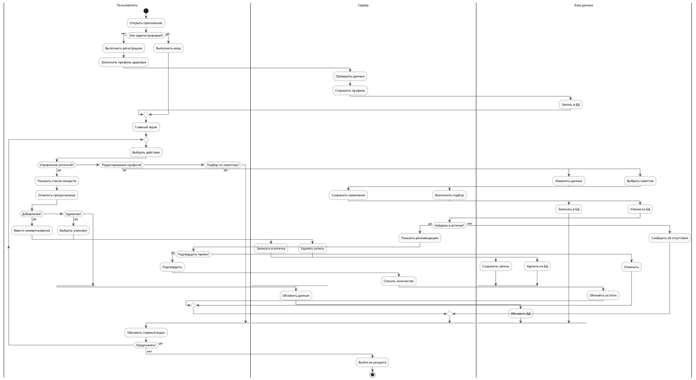

## Тип приложения

Web Multi Page Application

## Раскрытие проекта в нотации C4

### Context (L1)

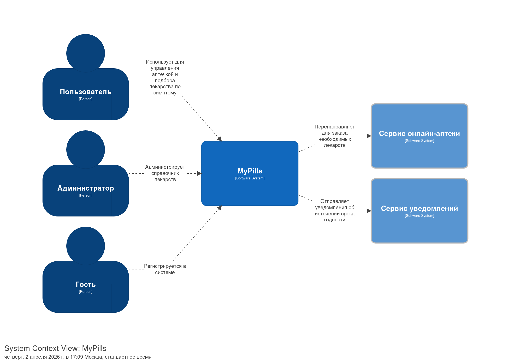

### Container (L2)

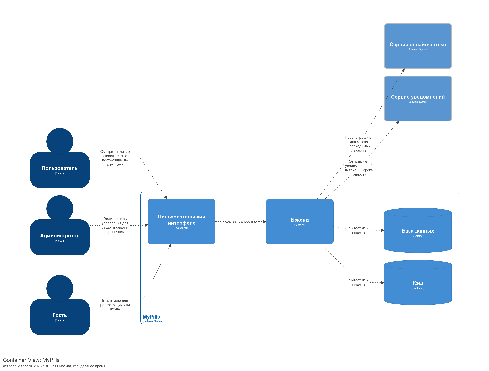

### Component (L3)

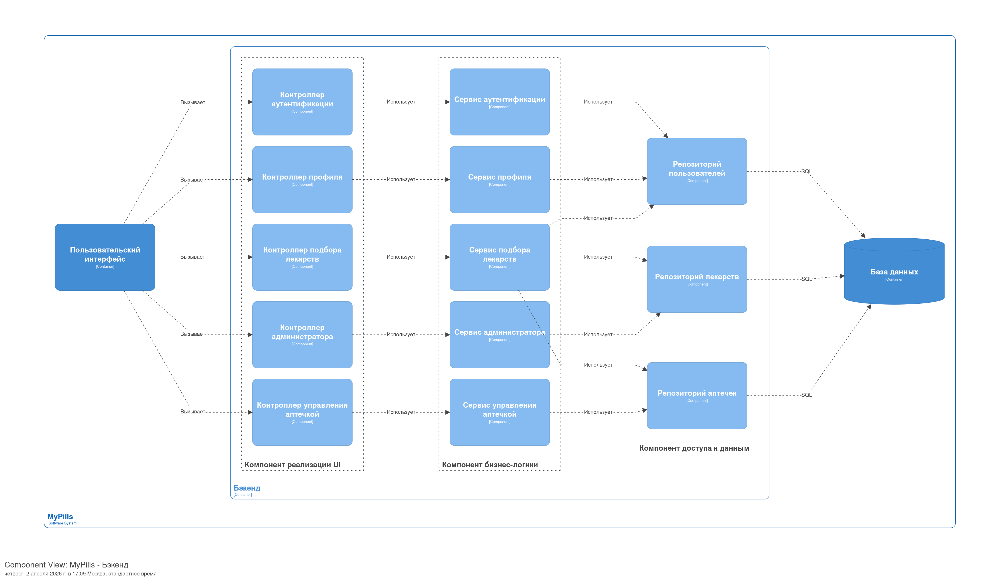

### Code (L4)

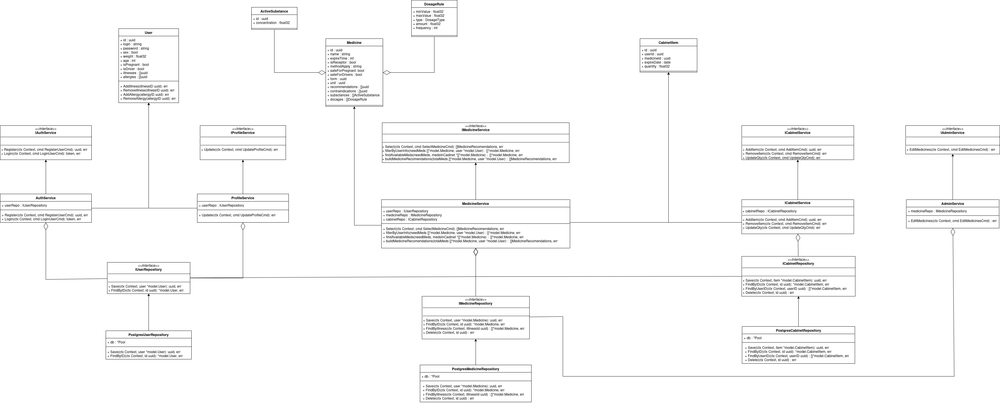

## Диаграммы последовательностей

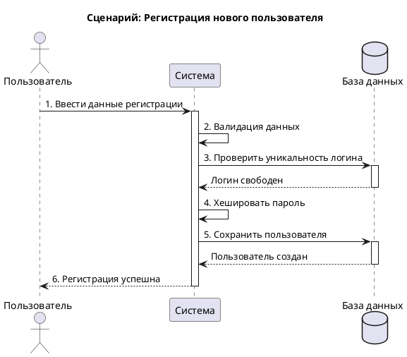

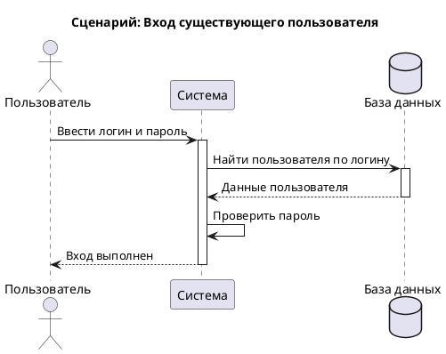

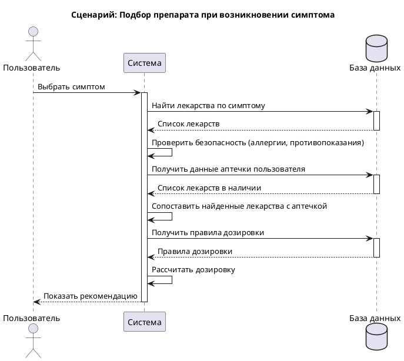

## Диаграмма БД

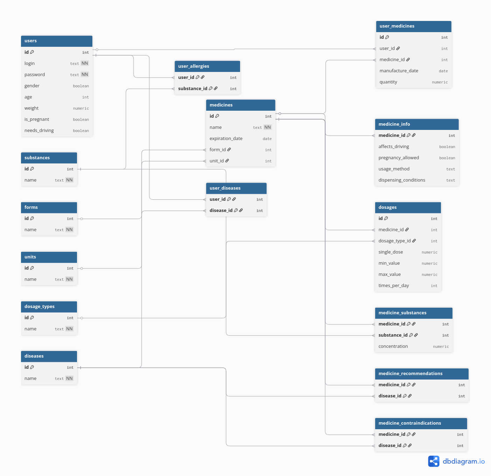